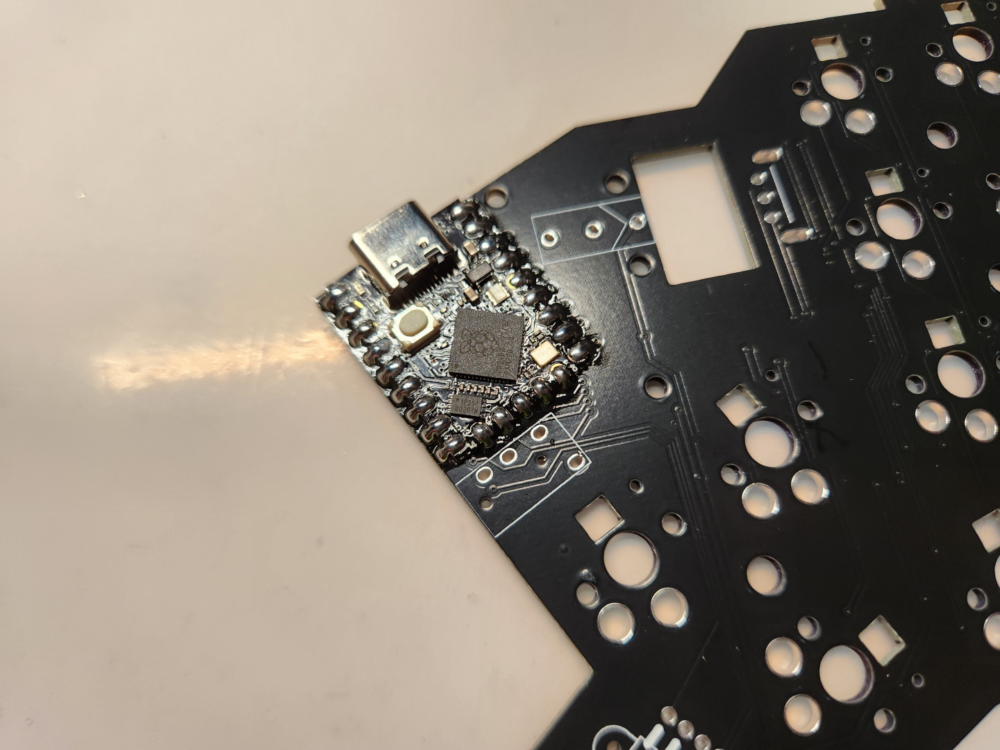

# 組裝說明

## 韌體燒錄

> **Note**
>
> RP2040系列的韌體燒錄方式大同小異，不管是不是Reset、Bootloader雙按鈕的版本MCU，都有一個相同的燒錄方式。

- 按住Bootloader按鈕之後再接上電腦，電腦本機就會跳出燒錄韌體的硬碟位置。

- 接著再將.uf2的韌體檔案移動至硬碟位置即可完成燒錄。

## 電路板及主控板

- 首先將燒錄好韌體的2片主控板跟左右手電路板準備好。

- 接著剪下一段紙膠帶，對好位置把主控板用膠帶先固定好。

- 先將其中一排焊盤先用焊錫固定好，再將膠帶撕掉。

- 最後再用焊錫把其他位置的焊盤都焊上。

