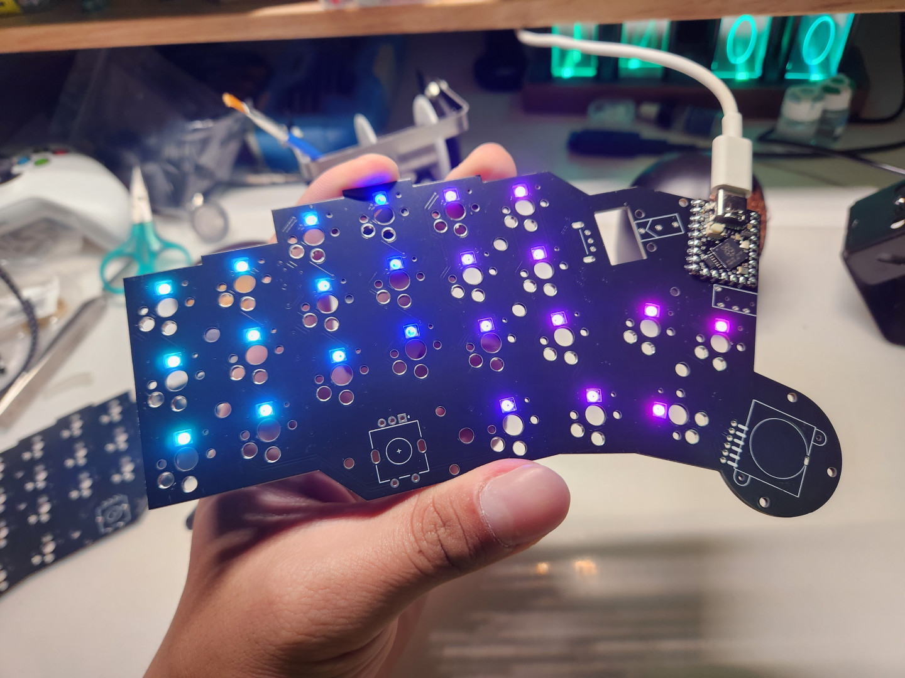

# Building Guide

- [中文版本（Chinese Readme）](guide.md)。
- 英文版本（English Readme）。

## Firmware

> **Note**
>
> The firmware programming method of RP2040 series is more or less the same, no matter whether it is the version of MCU with Reset and Bootloader dual buttons or not, all of them have the same programming method.

- Press and hold the Bootloader button and then connect to the computer, the local computer will show you the location of the hard drive where the firmware is burned.

- Then move the .uf2 firmware file to the hard drive to finish flashing.

## PCB and MCU

- First of all, prepare the two MCU and the left and right PCBs.

- Cut a piece of paper tape and fix the MCU with the tape in the right position.

- Fix one of the rows of pads with solder first, and then tear off the tape.

- Then use solder to attach the pads at the other locations.

## SMD Parts

- Please refer to the picture for the mounting method of 1N4148 diode.

- Solder the 52 diodes together.

- The following photo shows how to install SK6812Mini-E, if you don't want to install LED lights, please skip this step.

- Be careful not to leave the soldering iron on the soldering pad for too long, as the LEDs may be burnt out.

- After fixing the LED, you can connect it to the computer and test it, and the default light of the keyboard is on.

- After the diodes and LEDs are completed, the hot-swap sockets are finally attached to the board.

## Encoder and Jack

> **Warning**
>
> Due to a problem with this version, there is a difference in the way things are done here and in the photos, so please be sure to pay attention to the text.

- Prepare the Mouse Wheel, Mouse Microswitch, Mouse Encoder, Rotary Encoder, TRRS Holder, and Joy-con Joystick, and secure them to the PCB.

- The first step is to solder the mouse encoder in place and then attach the mouse wheel to the hexagonal wheel.

- Then weld the mouse microswitch in place at the pads.

> **Note**
>
> If you don't do this first, the mouse wheel will not be properly installed on the encoder, so be careful.

- Solder the rotary encoder, TRRS holders, and Joy-con joystick as well.

- Then you can test the power on the left and right side of the keyboard, be sure to test the LEDs and the signals of the left and right keyboard keys at this time. (The photo is a schematic picture, the whole installation is not finished.)

## Keyboard Building

- Prepare the 15mm spacers and 3mm screws, and install the post that holds the mouse wheel in place.

- Attach the spacers posts from the back of the left and right hand PCBs. 

- Prepare 8mm screws, M2 nuts and M2 spacers, and fix them to the left and right side of the bottom case in order.

- Fix the 8mm screws on the left and right sides as shown in the photo.

- Align the screw holes on the board and place the board on the base plate.

- Next, prepare 6mm and 7mm spacers.

- 6mm brass post for Joy-con joystick, 7mm brass post for rotary encoder and MCU.。

- Then prepare the positioning plate, 4mm spacers and 3mm screws.

- Secure them to the screw holes in the plate.

- Next, assemble the plate with the bottom case.

- Use 3mm screws to secure the locator plate from the back of the bottom case.

- The final step is to secure all the covers to the keyboard.

- When you're done, turn the keyboard over to the back and stick the rubber feet on it.

- Just paste it roughly like the picture below, and paste it more where it needs to be subjected to stronger force to make it more stable.

- Finish the two hands section and you're done.

- install switches.

- Put on the keycap and test the lighting effect

## Troubleshooting

- The LED light is on by default, if the LED light is not soldered and fixed completely, the light effect will run out, and in serious cases, the computer will not be able to recognise the keyboard, then try to turn off the light to exclude this problem directly, and then solder the LED to fix it well.
- If a single key does not trigger, please check in order: hot-swap socket, diode, switches.
- If a column/row does not trigger, please check to see if the MCU is not soldered properly.
- Don't forget to test the knobs and joysticks as they have their own keys.
- The test method of the encoder is to test the preset functions: volume up and down, scroll up and down.

I hope this can help you to solve any difficulties in the installation, thank you.

