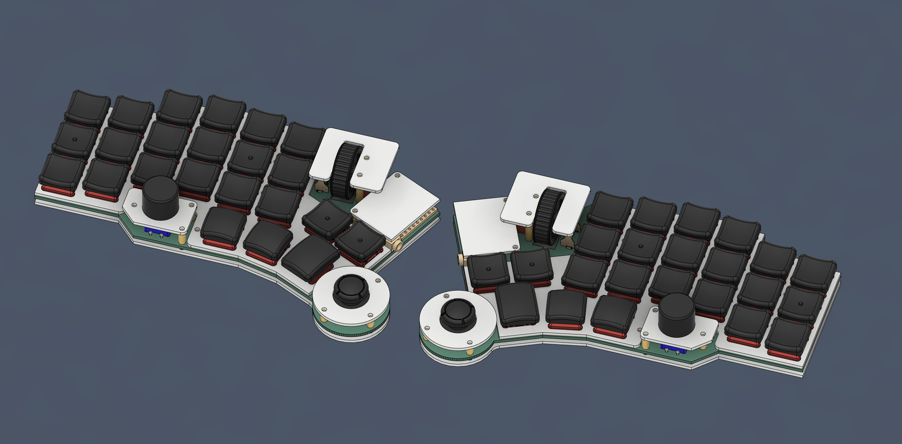
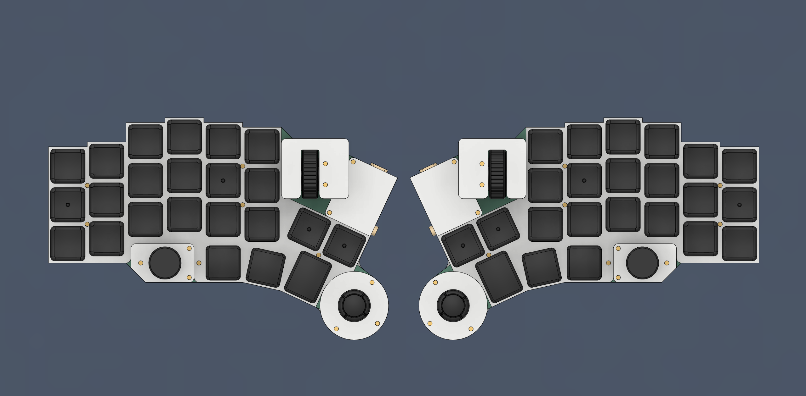

# Prime52 v1

## 詳細說明

一直到現在為止，我還是無法適應軌跡球...

我個人沒有辦法去適應軌跡球的移動模式，更不用說要用什麼方式去操作它，因此在我將探索者1號設計出來的當下，我就知道還有一個將遊戲搖桿（Joystick）加進鍵盤內的構想在，也確實也有不少前輩設計出來，比如Dactyl Manuform Skeleton Edition的完整STL模型中，就有搖桿的存在。但礙於當時的我沒有足夠地了解3D建模及QMK韌體，一直到現在才有能力將這個很久以前就一直深埋在內心的夢想付諸實行。

它叫做Prime52，很簡單直接地說，它就是搭載Joy-con搖桿、EC-11旋轉編碼器及滑鼠滾輪的一把矮軸鍵盤，支援Choc v1、v2熱插拔。

## 使用材料

|名稱|數量|備註|連結|
|--|--|--|--|
|PCB|1|左、右|-|
|FR4外殼|2|含擋板|-|
|`RP2040Supermini`|2|-||
|`EC-11`旋鈕編碼器|2|高`15mm`||
|`EC-11`編碼器帽蓋|2|可選配，有提供3D模型||
|`EC10E`滑鼠編碼器|2|高`11mm`||
|`MR-0017`滑鼠滾輪|2|-||
|`Joy-con`搖桿|2|`6pin`直插式||
|`3.5mm` TRRS座|2|`4Pin`直插式||
|M2x`4mm` 雙通銅柱|12|定位板用||
|M2x`6mm` 雙通銅柱|6|搖桿用||
|M2x`7mm` 雙通銅柱|10|擋板用||
|M2x`15mm` 雙通銅柱|4|滑鼠滾輪用||
|M2x`3mm` 扁頭螺絲|48|-||
|M2x`8mm` 扁頭螺絲|16|-||
|`M2` 螺母|16|-||
|`M2` 防滑墊片|16|||
|`ø8x1.5mm` 防滑墊片|-|-||
|滑鼠用`微動開關`|2|-||
|凱華`Choc`規格鍵軸|46|支援v1、v2||
|凱華`Choc`系列熱插拔座|46|-||
|`SK6212Mini-E` 反向LED燈|46|選配||

> **Note**
>
> 組裝鍵盤前務必先將韌體刷入MCU中，便測試及安裝方面會比較輕鬆容易：[點我進入組裝說明](guide.md)

## 現階段版本問題點

- 滑鼠滾輪安裝上的困難，未來改進有無按鍵雙支援。
- 滑鼠編碼器的脈衝問題（暫時無法解決）。
- MCU的侷限性，未來可以支援更多類型的MCU，往大眾常使用的為主。
- 電路板的走線問題，也是無法支援更多MCU的主因。

這是實際到手的`v1`版本在組裝上遇到的問題，`v2`版本的PCB會解決這個問題，並且會開發`MX`及`GLP`的版本出來。

## 使用資源

- [QMK Firmware](https://qmk.fm/).
- [VIAL](https://get.vial.today/).
- [KiCAD](https://www.kicad.org/) version `7.0.5.`
- [JLCPCB](https://jlcpcb.com/).
- [DeepL](https://www.deepl.com/translator).
- [AutoDesk Fusion](https://www.autodesk.com/products/fusion-360/free-trial).

