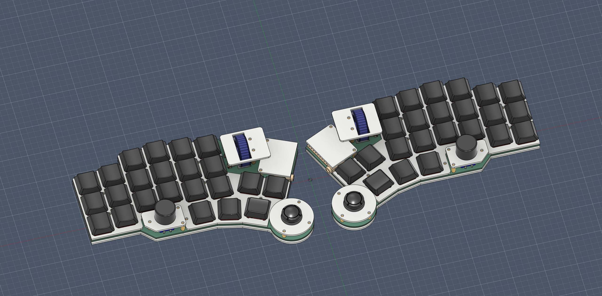
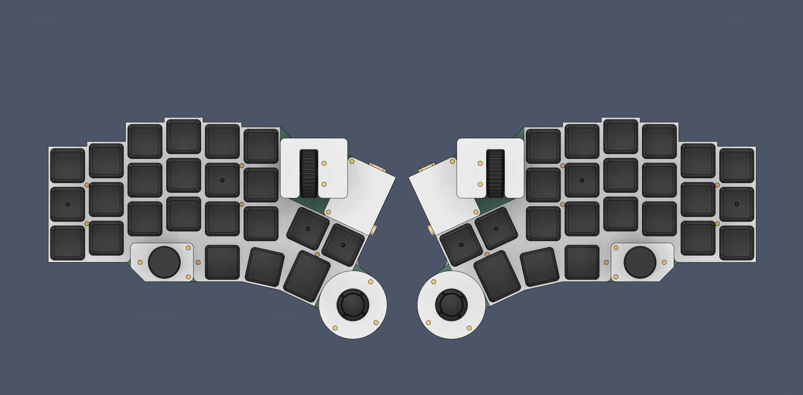
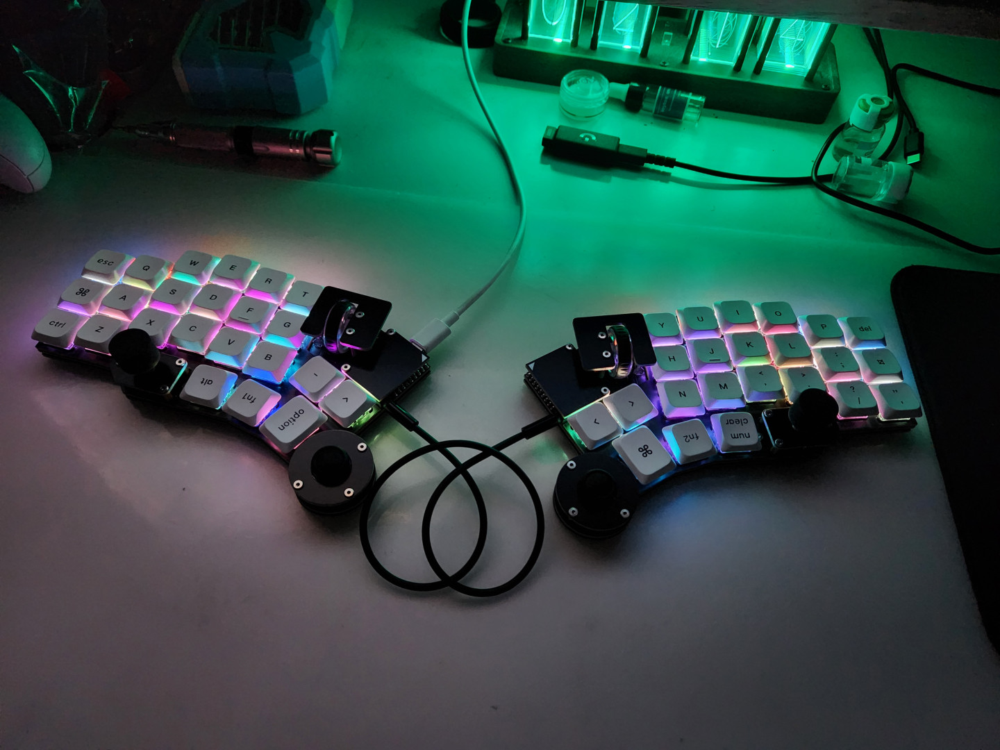
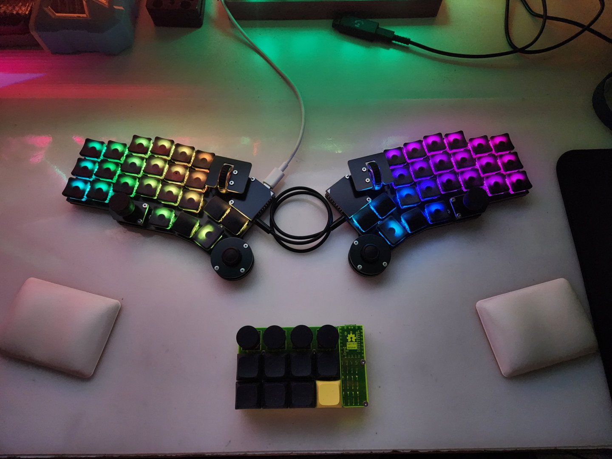
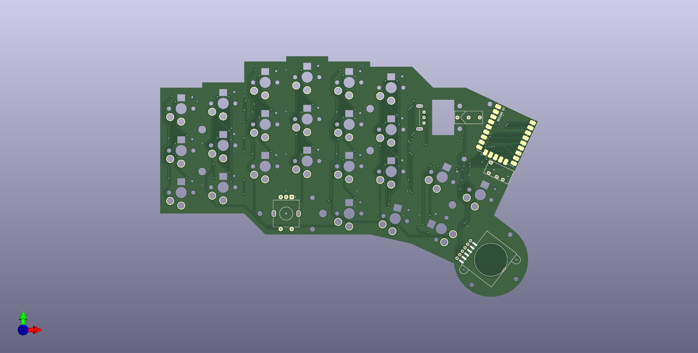
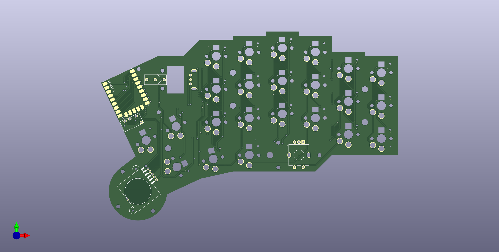
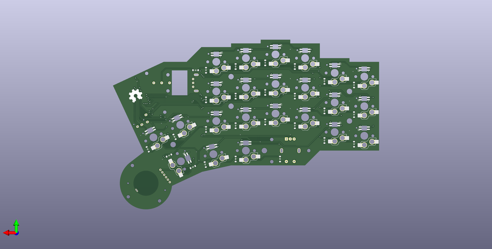
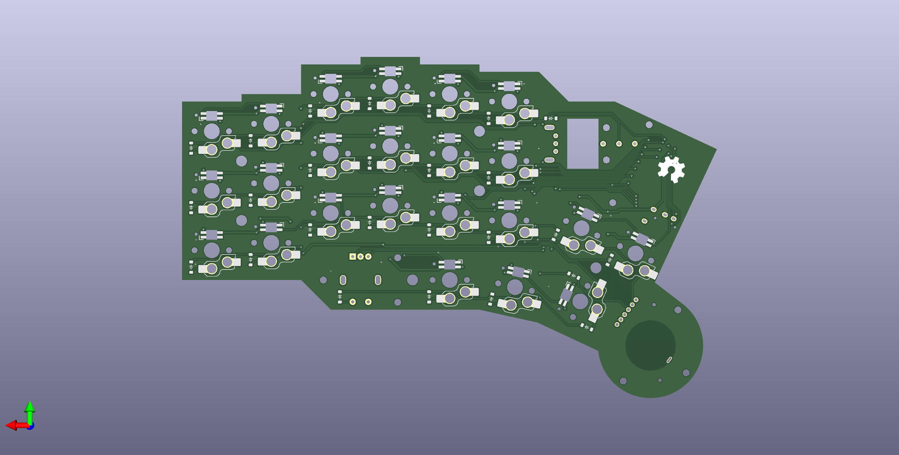

# Prime52 v1

- [中文說明（Chinese Readme）](readme.md)。
- 英文說明（English Readme）。

|||
|--|--|
|||

## Descruption

Until now, I couldn't get used to the trackball...

Personally, I had no way of adapting to the trackball's movement patterns, let alone how to operate it, so as soon as I designed Explorer RxCT, I knew that there was an idea for a joystick to be added to the keyboard, and indeed there were a number of predecessors who had designed them, such as the Dactyl Manuform Skeleton Edition. For example, the DM Skeleton Edition has a joystick in the full STL model. However, due to the fact that I didn't know enough about 3D modelling and QMK firmware at that time, I was not able to implement this dream that had been buried in my heart for a long time until now.

It's called the Prime52, and to put it simply, it's a low profile keyboard with a Joy-con joystick, EC-11 rotary encoder, and mouse wheel, and it supports Choc v1 and v2 hot-swapping.

## Lists

|Item|Amount|Note|Link|
|--|--|--|--|
|PCB|1|Left, Right|-|
|FR4 case|2|Include Case-covers|-|
|`RP2040Supermini`|2|-|[Link](https://www.aliexpress.com/item/1005006096780891.html?channel=twinner)|
|Rotray Encoder `EC-11`|2|`H15mm`|[Link](https://www.aliexpress.com/item/1005006104167148.html?channel=twinner)| 
|`EC-11` Encoder Cap|2|`Optional`, have 3D model|-|
|`EC10E` Mouse Encoder|2|`H11mm`|[Link](https://www.aliexpress.com/item/1005006279296138.html?channel=twinner)|
|`MR-0017` Mouse Wheel|2|`Optional`, have 3D model|[Link](https://www.aliexpress.com/item/1005005878223914.html?channel=twinner)|
|`Joy-con` Joystick|2|`6pin` THT|[Link](https://vi.aliexpress.com/item/1005006061159473.html)|
|`3.5mm` TRRS Jack|2|`4Pin` THT|[Link](https://vi.aliexpress.com/item/1005003299392377.html?channel=twinner)|
|M2x`4mm` Spacer|12|for Plate|-|
|M2x`6mm` Spacer|6|for Joystick|-|
|M2x`7mm` Spacer|10|for Case-covers|-|
|M2x`15mm` Spacer|4|for Mouse Wheel|-|
|M2x`3mm` Screw|48|-|-|
|M2x`8mm` Screw|16|-|-|
|`M2` Nut|16|-|-|
|`M2` washers|16||-|
|`ø8x1.5mm` Rubber feets|-|-|-|
|Mouse `Microswitch`|2|-|[Link](https://vi.aliexpress.com/w/wholesale-mouse-switch.html?spm=a2g0o.productlist.search.0)|
|Diode `1N4148`|52|`SOD-123` SMD|-|
|Kailh `Choc` Switches|46|Supported v1、v2|-|
|Kailh `Choc` Hot-swap Socket|46|-|[Link](https://vi.aliexpress.com/item/1005003879769486.html?channel=twinner)|
|LED `SK6212Mini-E`|46|`Optional`|[Link](https://vi.aliexpress.com/item/1005005956813491.html?channel=twinner)|

> **Note**
>
> The firmware must be flashed into the MCU before assembling the keyboard to make testing and installation easier: [Link to Building Guide](guide_en.md)

## Issue for this version

|||
|--|--|
|||

- Difficulty in installing the mouse wheel, to be improved in the future with or without dual support for the buttons.
- Mouse encoder pulse problem (not solved for the time being).
- The limitations of MCU, in the future, can support more types of MCU, to the public commonly used as the main.
- The wiring problem of the PCB is also the main reason for not being able to support more MCUs.
- Slave-side joystick potential drift, LED signals are sometimes unstable, it is possible to develop a new keyboard to directly change these problems. It seems to be symmetrical, but it is impossible to design a new keyboard.
- It looks symmetrical, but it can't be designed to be symmetrical (the main reason for the Joy-con joystick).

This is an assembly problem with the `v1` version that actually arrived, the `v2` version of the PCB will solve this problem, and `MX` and `GLP` versions will be developed.

## Information

- Datasheets from TTC, ALPS, Huano.
- [QMK Firmware](https://qmk.fm/).
- [VIAL](https://get.vial.today/).
- [KiCAD](https://www.kicad.org/) version `7.0.5.`
- [JLCPCB](https://jlcpcb.com/).
- [DeepL](https://www.deepl.com/translator).
- [AutoDesk Fusion](https://www.autodesk.com/products/fusion-360/free-trial).

